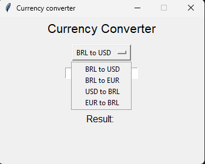
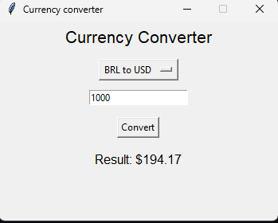
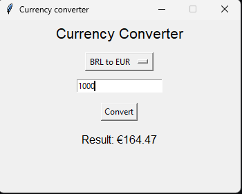
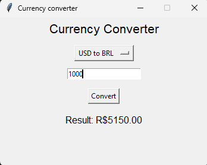
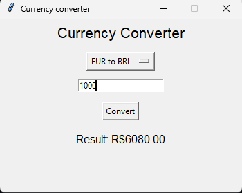

## Currency Converter (Python GUI) 💱

Um conversor de moedas moderno desenvolvido em Python, utilizando a biblioteca Tkinter para a interface gráfica. O projeto permite converter valores entre Real (BRL), Dólar (USD) e Euro (EUR) de forma simples e intuitiva.

## 📸 Demonstração

  
  
  
  
  

## ✨ Funcionalidades

Conversões Suportadas:

Real (BRL) para Dólar (USD).

Real (BRL) para Euro (EUR).

Dólar (USD) para Real (BRL).

Euro (EUR) para Real (BRL).

Interface Amigável: Menu dropdown para seleção de moedas e campo de entrada validado.

Tratamento de Erros: Alertas visuais caso o usuário insira caracteres inválidos ou deixe o campo vazio.

## 🛠️ Tecnologias Utilizadas

Python 3: Linguagem base do projeto.

Tkinter: Biblioteca nativa para criação da interface gráfica.

Programação Modular: Separação clara entre a lógica de cálculo e os elementos visuais.

## 📋 Como Executar
Como o projeto utiliza apenas bibliotecas nativas do Python, você não precisa instalar dependências externas.

1. Clone o repositório:

Bash
git clone https://github.com/seu-usuario/currency-converter-python.git

Entre na pasta do projeto:

Bash
cd "Currency Converter"

Execute o arquivo principal:
Bash
python main.py

## 📂 Organização dos Arquivos

main.py: Ponto de entrada que inicializa a interface.

gui.py: Contém toda a configuração da janela, botões, campos de texto e lógica da interface.

converters.py: Módulo responsável pelos cálculos matemáticos de conversão e taxas de câmbio.
